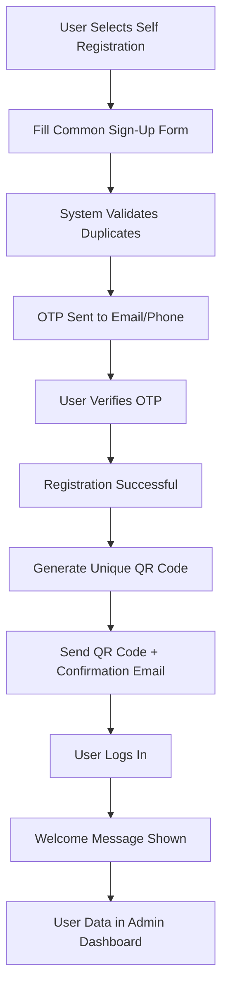
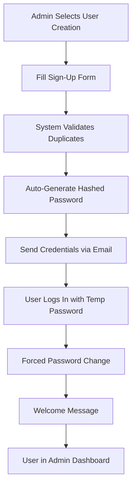
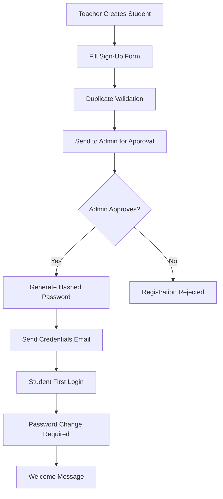
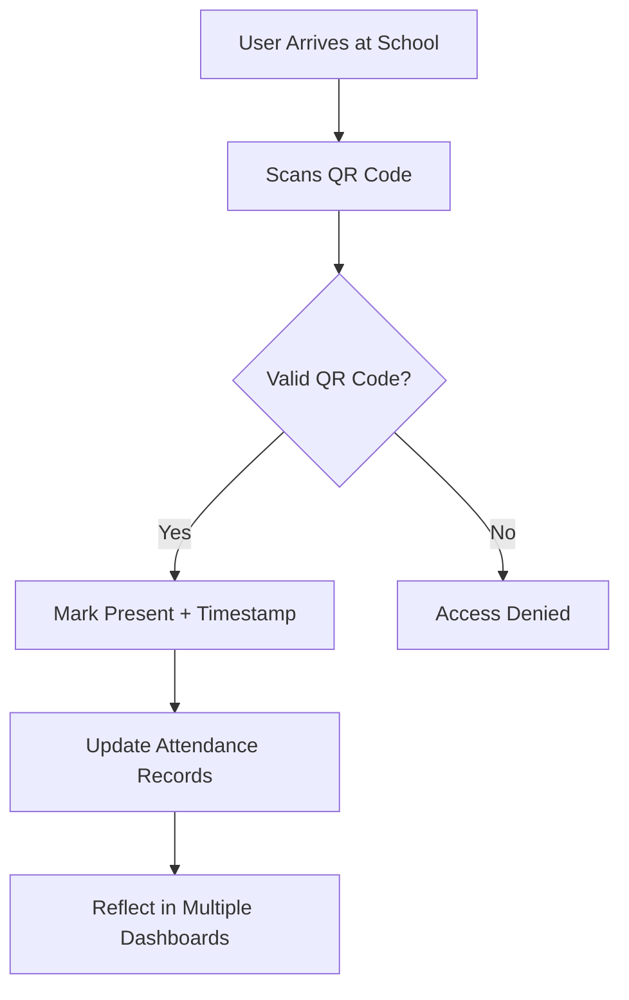
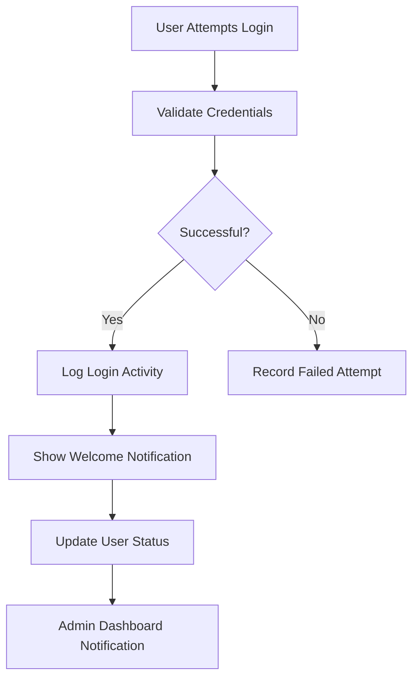

# EduMind School Management System - Complete Flow Design

## 🎯 SYSTEM OVERVIEW
EduMind is a comprehensive school management platform supporting multiple user roles with secure registration, QR-based attendance, and modern admin dashboard.

---

## 🔐 REGISTRATION SYSTEM (2 Options)

### Option 1: Self Registration (OTP-Based)


**Implementation Details:**
- **Common Form Fields:** First Name, Last Name, Email, Phone, Password, Role Selection
- **Role-Specific Fields:**
  - Student: Roll Number, Class
  - Staff: Designation, Subject (if teaching)
  - Parent: Children Names, Relationship
- **Duplicate Validation:** Email, Phone, ID checks
- **OTP Process:** 4-digit code, 60s resend cooldown
- **QR Code:** Unique per user, sent via email
- **Welcome Flow:** Post-login welcome message

### Option 2: Admin/Teacher Assisted Registration

#### A. Admin-Created Registration


#### B. Teacher-Created Student Registration


---

## 📊 ATTENDANCE SYSTEM (QR-Based)

### Core Flow


### Attendance Data Flow
- **Student Profile:** Personal attendance history
- **Teacher Dashboard:** Class attendance overview
- **Admin Attendance Section:** School-wide analytics
- **Real-time Updates:** Live attendance tracking

### QR Code System
- **Generation:** Unique per user during registration
- **Format:** Encrypted user ID + timestamp validation
- **Security:** Time-limited validity (24 hours)
- **Backup:** Manual attendance marking capability

---

## 🔔 LOGIN & NOTIFICATIONS SYSTEM

### Login Flow


### Notification Types
1. **Welcome Notifications:** Post-login greetings
2. **System Notifications:** Important updates
3. **Activity Notifications:** User actions tracking
4. **Admin Alerts:** Login activities, system events

### Real-time Features
- **Live Login Notifications:** Admin sees real-time user logins
- **Activity Tracking:** Role-based activity monitoring
- **Status Updates:** Online/offline user status

---

## 🎨 UI DESIGN SYSTEM

### Modern Admin Dashboard
```css
/* Color Scheme */
--primary: #3B82F6 (Blue)
--secondary: #10B981 (Green)
--accent: #F59E0B (Amber)
--background: #FFFFFF (White)
--surface: #F8FAFC (Light Gray)
--text-primary: #1F2937 (Dark Gray)
--text-secondary: #6B7280 (Medium Gray)
```

### Dashboard Components
1. **Header:** Logo, User Profile, Notifications, Settings
2. **Sidebar:** Navigation Menu with Role-based Access
3. **Main Content:** Dashboard Cards, Charts, Tables
4. **Status Indicators:** Online/Offline, Active/Inactive
5. **Action Buttons:** Primary actions with hover effects

### Key UI Elements
- **Clean Layout:** White background, subtle shadows
- **Role-based Sections:** Different views per user type
- **Responsive Design:** Mobile-first approach
- **Professional Styling:** Secure and trustworthy appearance

---

## 👥 USER ROLES & PERMISSIONS

### Admin Role
- Full system access
- User management (create, edit, delete)
- System configuration
- Analytics and reporting
- Attendance monitoring
- Notification management

### Teacher Role
- Student management (limited)
- Attendance marking
- Grade management
- Assignment creation
- Class communication
- Schedule management

### Student Role
- Personal profile access
- Attendance viewing
- Grade viewing
- Assignment submission
- Fee status checking

### Parent Role
- Child information access
- Academic progress monitoring
- Communication with teachers
- Fee payment tracking

### Non-Teaching Staff Role
- Task management
- Schedule viewing
- Performance tracking
- Department-specific functions

---

## 🔒 SECURITY FEATURES

### Authentication
- JWT token-based authentication
- Password hashing (bcrypt)
- OTP verification for registration
- Session management

### Authorization
- Role-based access control (RBAC)
- Route-level permissions
- API endpoint protection
- Data access restrictions

### Data Protection
- Input validation and sanitization
- SQL injection prevention
- XSS protection
- Secure password policies

---

## 📱 RESPONSIVE DESIGN

### Breakpoints
- **Mobile:** < 768px
- **Tablet:** 768px - 1024px
- **Desktop:** > 1024px

### Mobile-First Approach
- Touch-friendly interfaces
- Optimized navigation
- Readable typography
- Efficient space usage

---

## 🚀 IMPLEMENTATION PHASES

### Phase 1: Core Registration System ✅
- Self-registration with OTP
- Admin-assisted registration
- Basic validation and security

### Phase 2: Attendance System 🔄
- QR code generation and scanning
- Real-time attendance tracking
- Multi-dashboard integration

### Phase 3: Notification System 📋
- Real-time notifications
- Login activity tracking
- Admin dashboard alerts

### Phase 4: Advanced UI/UX 🎨
- Modern admin dashboard
- Responsive design
- Enhanced user experience

### Phase 5: Advanced Features 🔧
- Analytics and reporting
- System configuration
- Performance optimization

---

## 🧪 TESTING STRATEGY

### Unit Testing
- Component testing
- API endpoint testing
- Model validation testing

### Integration Testing
- End-to-end user flows
- Cross-system functionality
- Performance testing

### Security Testing
- Authentication testing
- Authorization testing
- Data protection validation

---

## 📈 SCALING CONSIDERATIONS

### Database Optimization
- Indexing strategy
- Query optimization
- Connection pooling

### Performance
- Caching mechanisms
- Load balancing
- CDN integration

### Monitoring
- System health checks
- Performance metrics
- Error tracking

---

## 🎯 SUCCESS METRICS

- **User Adoption:** Registration completion rate
- **System Reliability:** Uptime and error rates
- **User Satisfaction:** Login frequency, feature usage
- **Attendance Accuracy:** QR scan success rate
- **Admin Efficiency:** Dashboard usage and task completion

This comprehensive system design ensures EduMind provides a complete, secure, and user-friendly school management experience for all stakeholders.
